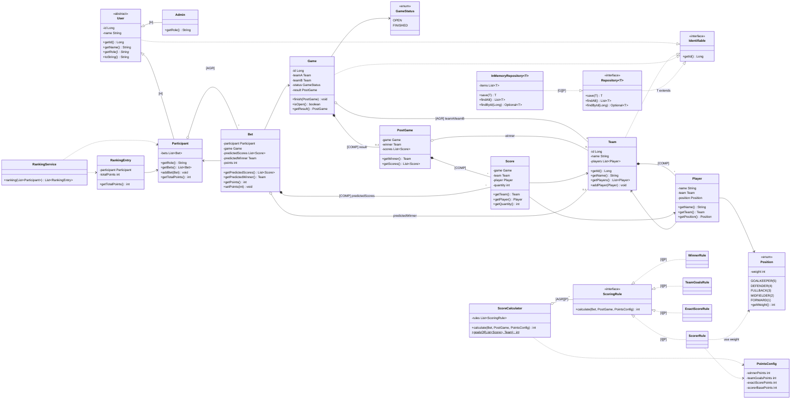

# Diagrama de Classes — Bolão da Copa 2026

Diagrama fiel ao código em `src/`. Recursos de POO exigidos pelo desafio:
**[H]** herança · **[P]** polimorfismo · **[I]** interface · **[AGR]** agregação · **[COMP]** composição · **[G]** generics

> **Como visualizar bonito no VSCode:** instale a extensão
> **"Markdown Preview Mermaid Support"** (`bierner.markdown-mermaid`) ou
> **"Mermaid Chart"** (`MermaidChart.vscode-mermaid-chart`) e abra o preview do Markdown
> (`Cmd+Shift+V`). O bloco abaixo é renderizado automaticamente como diagrama.

---

## Mapa rápido dos pacotes (`src/`)

| Pacote | Classes |
|---|---|
| `model` | `Identifiable` (interface) |
| `model.user` | `User` (abstract), `Admin`, `Participant` |
| `model.team` | `Team`, `Player` |
| `model.game` | `Game`, `PostGame`, `Score` |
| `model.bet` | `Bet` |
| `model.enums` | `Position`, `GameStatus` |
| `service` | `ScoringRule` (interface), `WinnerRule`, `TeamGoalsRule`, `ExactScoreRule`, `ScorerRule`, `PointsConfig`, `ScoreCalculator`, `RankingService`, `RankingEntry` |
| `repository` | `Repository<T>` (interface), `InMemoryRepository<T>` |
| `app` | `Main` |

## Onde cada conceito de POO aparece

- **[H] Herança** — `Admin` e `Participant` estendem `User` (abstrata).
- **[P] Polimorfismo** — `getRole()` sobrescrito; as 4 `ScoringRule` intercambiáveis em `ScoreCalculator`; `InMemoryRepository` via interface `Repository`.
- **[I] Interface** — `Identifiable`, `Repository<T>`, `ScoringRule`.
- **[AGR] Agregação** — `Participant` ↔ `Bet`; `Game` ↔ `Team`; `ScoreCalculator` ↔ `ScoringRule`.
- **[COMP] Composição** — `Team` → `Player`; `Game` → `PostGame`; `PostGame`/`Bet` → `Score`.
- **[G] Generics** — `Repository<T extends Identifiable>` e `InMemoryRepository<T>`.

## Regras de pontuação (resumo)

| Regra | Pontua quando | Valor padrão (`PointsConfig`) |
|---|---|---|
| `WinnerRule` | acertou a seleção vencedora (ou o empate) | `winnerPoints = 5` |
| `TeamGoalsRule` | acertou o nº de gols de cada equipe (soma por equipe) | `teamGoalsPoints = 3` |
| `ExactScoreRule` | cravou o placar completo das duas equipes | `exactScorePoints = 10` |
| `ScorerRule` | acertou gols de um jogador → `base × peso da posição` | `scorerBasePoints = 2` |
